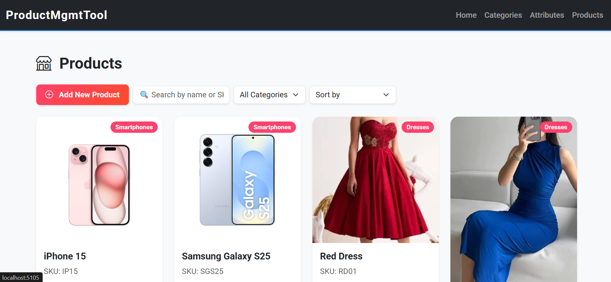

# Product Management Tool

An internal ASP.NET Core MVC tool for managing a dynamic e-commerce product catalog with category-specific attributes.

---

## Design Justification

### Core Problem:
Products from different categories have **different attributes**. For example:
- Smartphones: RAM, Storage, OS
- Dresses: Size, Color, Material

Hardcoding these attributes in the Product table would break normalization and require frequent schema changes.

### Solution: **Entity-Attribute-Value (EAV) Pattern**
- **Scalability:** Add new categories without changing the DB schema.
- **Flexibility:** Each category has its own attributes via `CategoryAttributeDefinitions`.
- **Normalization:** Data is stored in separate tables:
  - `Category`
  - `CategoryAttributeDefinition`
  - `Product`
  - `ProductAttributeValue`
- **Trade-off:** Fetching a product with all attributes requires joins across tables.

---

## Database Structure

- **Category**
  - Id (PK, int)
  - Name (nvarchar(100))
  - Slug (nvarchar(150))
  - Description (nvarchar(500), nullable)
  - CreatedAt (datetime)
  - UpdatedAt (datetime)

- **CategoryAttributeDefinition**
  - Id (PK, int)
  - Name (nvarchar(100))
  - DataType (`string`, `number`, `date`, `bool`)
  - IsRequired (bool)
  - DisplayOrder (int)
  - CategoryId (FK, int)

- **Product**
  - Id (PK, int)
  - Name (nvarchar(150))
  - SKU (nvarchar(100))
  - Price (decimal)
  - CategoryId (FK, int)
  - CreatedAt (datetime)
  - UpdatedAt (datetime)

- **ProductAttributeValue**
  - Id (PK, int)
  - ProductId (FK, int)
  - CategoryAttributeDefinitionId (FK, int)
  - Value (nvarchar(500))

---

## ERD & Class Diagram

- [ERD](Docs/ERD.png) – Shows entities, relationships, and keys  
- [Class Diagram](Docs/ClassDiagram.png) – Shows classes, relationships, and methods

---

## How to Run

1. Install **.NET 9.0 SDK** and **MySQL**.
2. Create a MySQL database: `ProductMgmtDb`.
3. Update `appsettings.json` connection string:

```json
{
  "ConnectionStrings": {
    "DefaultConnection": "server=localhost;database=ProductMgmtDb;user=root;password=YourPassword"
  }
}

4. Apply migrations:
   dotnet ef database update
5. Run the app:
   dotnet run
6. Navigate to https://localhost:5000 or To find in Terminal

- **Usage Flow**
  - Create Categories: Go to Categories → Create.
  - Define Attributes: On category details page, add attributes like RAM, Color, Size.
  - Create Products: Go to Products → Create. Select category, dynamic attribute form appears.
  - Edit / Details / Delete: Manage both categories and attributes from the admin panel.

- **Features**
  - Full CRUD for Products, Categories, Attributes.
  - Dynamic attribute forms per category.
  - Slug generation and timestamps.
  - Validation via ProductValidationService.
  - Normalized EAV schema for scalability.
  - Real-time search, filtering, and sorting in UI (like Amazon/Flipkart style).

- **Screenshots**





