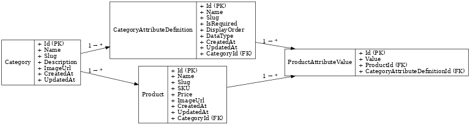
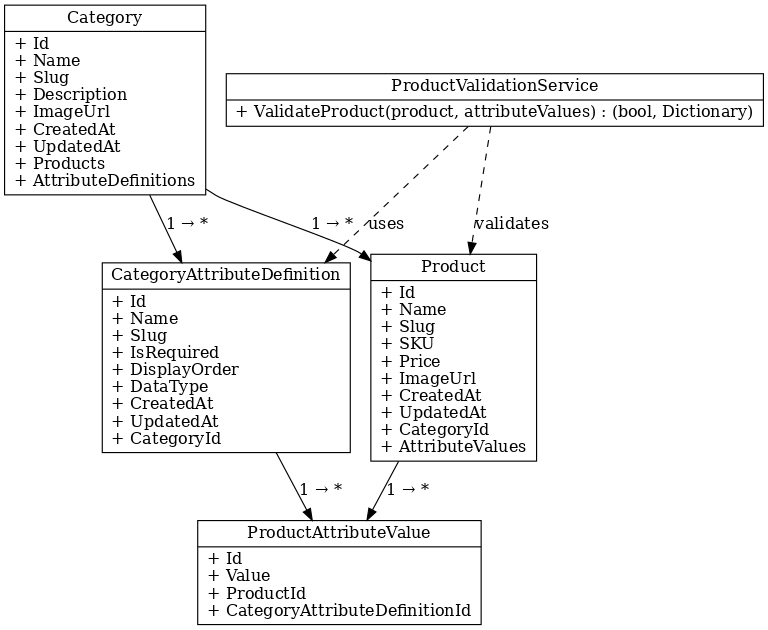
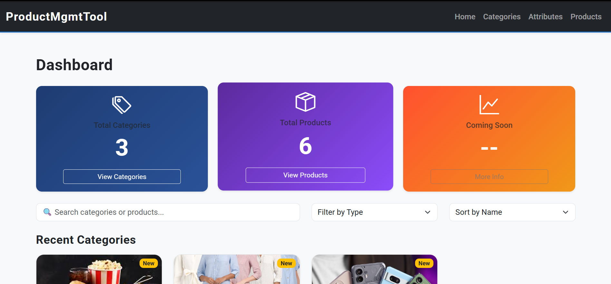

# Product Management Tool

An internal **ASP.NET Core MVC** tool for managing a dynamic e‑commerce product catalog with **category‑specific attributes**.

---

## Design Justification

### Core Problem:

Different product categories need **different attributes** (Smartphones → RAM/OS; Dresses → Size/Color). Hard‑coding attributes on the `Product` table couples the schema to business rules and breaks normalization.

### The Approach: EAV (Entity‑Attribute‑Value) per Category
We use a **category‑scoped EAV** model:

- **Category** defines a set of **CategoryAttributeDefinition** rows (name, type, required, order).
- **Product** belongs to a **Category**.
- Each **Product** stores its attribute values as **ProductAttributeValue** rows that reference the corresponding attribute definition.

**Why this design?**

- **Scalable / Future‑proof**: add categories and attributes without altering tables.
- **Normalized**: no sparse columns or NULL clutter on the `Product` table.
- **Flexible**: supports heterogeneous categories.
- **Trade‑off**: reading/writing requires joins and validation logic (handled by `ProductValidationService`).

---

## Database Structure

### Category
- Id (PK, int)  
- Name (nvarchar(100))  
- Slug (nvarchar(150))  
- Description (nvarchar(500), nullable)  
- ImageUrl (nvarchar(500), nullable)  
- CreatedAt (datetime)  
- UpdatedAt (datetime, nullable)

### CategoryAttributeDefinition
- Id (PK, int)  
- Name (nvarchar(100))  
- Slug (nvarchar(150))  
- DataType (`string`, `number`, `date`, `bool`)  
- IsRequired (bool)  
- DisplayOrder (int)  
- CategoryId (FK → Category.Id)  
- CreatedAt (datetime)  
- UpdatedAt (datetime, nullable)

### Product
- Id (PK, int)  
- Name (nvarchar(150))  
- Slug (nvarchar(150))  
- SKU (nvarchar(100))  
- Price (decimal(18,2))  
- ImageUrl (nvarchar(500), nullable)  
- CategoryId (FK → Category.Id)  
- CreatedAt (datetime)  
- UpdatedAt (datetime, nullable)

### ProductAttributeValue
- Id (PK, int)  
- ProductId (FK → Product.Id)  
- CategoryAttributeDefinitionId (FK → CategoryAttributeDefinition.Id)  
- Value (nvarchar(500))

### Indexes

- Unique: `Category (Slug)`
- Unique: `Product (Slug)`, `Product (SKU)`
- Composite: `ProductAttributeValue (ProductId, CategoryAttributeDefinitionId)` — prevents duplicates per product/attribute.

---

## ERD & Class Diagram




(See the images for keys, relationships, and cardinalities.)

---

## How to Run

1. Install **.NET 9.0 SDK** and **MySQL** (or switch provider to SQL Server/PostgreSQL if preferred).
2. Create database:

```sql
CREATE DATABASE ProductMgmtDb;
```

3. Update `appsettings.json`:

```json
{
  "ConnectionStrings": {
    "DefaultConnection": "server=localhost;database=ProductMgmtDb;user=root;password=YourPassword"
  }
}
```

4. Apply migrations:

```bash
dotnet ef database update
```

5. Run the app:

```bash
dotnet run
```

6. Browse to `https://localhost:5001` or `http://localhost:5000` (per your launch settings).

---

## Usage Flow

- **Create Categories** → Add a category (e.g., Smartphones, Dresses).  
- **Define Attributes** → For each category, define attributes (e.g., RAM, Color, Size).  
- **Create Products** → Select category → dynamic attribute form appears.  
- **Manage** → Edit, view, or delete categories, attributes, and products.

---

## Features

- CRUD for **Categories**, **Attributes**, **Products**  
- Dynamic attribute forms per category  
- Slug generation & timestamps  
- Validation via `ProductValidationService`  
- Normalized EAV schema for scalability  
- Real‑time search, filtering, and sorting (UI)

---

## Tech Stack

- **Frontend**: HTML, CSS, Bootstrap 5, jQuery  
- **Backend**: C# (ASP.NET Core MVC)  
- **ORM**: EF Core
- **Database**: MySQL (tested), compatible with others

---

## Screenshots




---

## Notes

- Screenshots live in `Docs/`; static assets are in `wwwroot/`.  
- Schema is **future‑proof**: add categories/attributes without schema changes.
